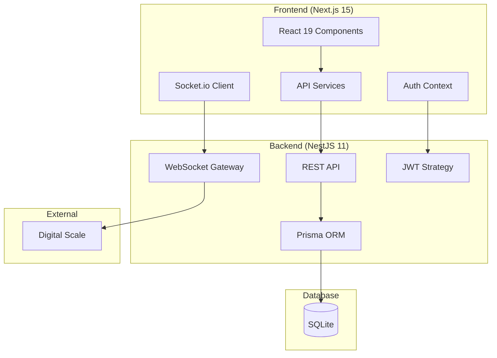

# 🌾 SmartMillScale

<div align="center">


**Timbang Otomatis, Proses Sistematis**

*A comprehensive digital weighing and grading system for palm oil mills with real-time scale integration*

[📖 Documentation](#-documentation) • [🚀 Quick Start](#-quick-start) • [🏗️ Architecture](#-architecture) • [🤝 Contributing](#-contributing)

</div>

---

## ✨ Features

### 🏭 **Mill Operations**
- **Real-time Weighing** - Digital scale integration with WebSocket communication
- **Automated Calculations** - Automatic gross, tare, and net weight calculations
- **Quality Grading** - Palm fruit quality assessment and classification
- **Receipt Generation** - Instant PDF receipt printing with company branding

### 📊 **Data Management**
- **Master Data** - Suppliers (Pemasok), Drivers (Sopir), and Vehicles (Kendaraan) management
- **Transaction History** - Complete weighing transaction records with search and filtering
- **Report Generation** - Daily, monthly, and grading reports with export capabilities
- **Data Validation** - Comprehensive input validation and error handling

### 🔐 **Security & Access Control**
- **JWT Authentication** - Secure token-based authentication system
- **Role-based Authorization** - Granular permission system (Admin, Supervisor, Operator)
- **Protected Routes** - Middleware-based route protection
- **Audit Trail** - Complete user activity logging

### 🌐 **Modern Architecture**
- **Real-time Updates** - Socket.io integration for live scale data
- **Responsive Design** - Mobile-first approach with Tailwind CSS
- **API Documentation** - OpenAPI/Swagger documentation
- **Type Safety** - Full TypeScript implementation

---

## 🏗️ Architecture



## 🛠️ Technology Stack

### Frontend
- **Framework**: Next.js 15 with App Router
- **UI Library**: React 19 with TypeScript
- **Styling**: Tailwind CSS + Radix UI
- **State Management**: React Context + Hooks
- **Forms**: React Hook Form + Zod validation
- **Real-time**: Socket.io Client
- **PDF Generation**: jsPDF
- **Testing**: Playwright

### Backend
- **Framework**: NestJS 11 with TypeScript
- **Database**: SQLite with Prisma ORM
- **Authentication**: JWT + Passport.js
- **Real-time**: Socket.io Gateway
- **Validation**: class-validator
- **API Documentation**: Swagger/OpenAPI
- **Security**: bcryptjs, CORS, Rate limiting

---

## 🚀 Quick Start

### Prerequisites

- **Node.js** 18+ and npm
- **Git** for version control

### 1. Clone & Install

```bash
# Clone the repository
git clone https://github.com/kskfullstack/smartmillscale.git
cd smartmillscale

# Install backend dependencies
cd backend
npm install

# Install frontend dependencies
cd ../frontend  
npm install
```

### 2. Environment Setup

**Backend Configuration** (`backend/.env`):
```env
DATABASE_URL="file:./dev.db"
JWT_SECRET="your-super-secure-jwt-secret-key"
JWT_EXPIRES_IN="24h"
```

**Frontend Configuration** (`frontend/.env.local`):
```env
NEXT_PUBLIC_API_URL="http://localhost:3001"
```

### 3. Database Setup

```bash
cd backend

# Generate Prisma client
npx prisma generate

# Run database migrations
npx prisma db push

# Seed initial data (optional)
npm run db:seed
```

### 4. Start Development Servers

**Terminal 1 - Backend**:
```bash
cd backend
npm run start:dev
```

**Terminal 2 - Frontend**:
```bash
cd frontend
npm run dev
```

### 5. Access Application

- **Frontend**: http://localhost:3000
- **API Documentation**: http://localhost:3001/api
- **Backend API**: http://localhost:3001

### 6. Default Login

```
Username: admin
Password: password123
```

---

## 📁 Project Structure

```
smartmillscale/
├── 📁 backend/                 # NestJS Backend
│   ├── 📁 src/
│   │   ├── 📁 auth/           # Authentication & Authorization
│   │   ├── 📁 user/           # User Management
│   │   ├── 📁 company/        # Company Profile
│   │   ├── 📁 timbangan/      # Weighing Transactions
│   │   ├── 📁 grading/        # Quality Grading
│   │   ├── 📁 scale/          # Digital Scale Integration
│   │   └── 📁 prisma/         # Database Service
│   ├── 📁 prisma/             # Database Schema & Seeds
│   └── 📄 package.json
│
├── 📁 frontend/                # Next.js Frontend  
│   ├── 📁 src/
│   │   ├── 📁 app/            # App Router Pages
│   │   ├── 📁 components/     # React Components
│   │   ├── 📁 lib/            # API Services & Utils
│   │   ├── 📁 contexts/       # React Contexts
│   │   └── 📁 hooks/          # Custom Hooks
│   └── 📄 package.json
│
└── 📄 README.md               # This file
```

---

## 📖 API Documentation

### Authentication Endpoints

| Method | Endpoint | Description |
|--------|----------|-------------|
| `POST` | `/auth/login` | User authentication |
| `POST` | `/auth/refresh` | Token refresh |
| `GET` | `/auth/profile` | Get user profile |

### Core Endpoints

| Resource | Base URL | CRUD Operations |
|----------|----------|-----------------|
| **Suppliers** | `/pemasok` | ✅ Create, Read, Update, Delete |
| **Drivers** | `/sopir` | ✅ Create, Read, Update, Delete |  
| **Vehicles** | `/kendaraan` | ✅ Create, Read, Update, Delete |
| **Weighing** | `/timbangan` | ✅ Create, Read, Update, Delete |
| **Grading** | `/grading` | ✅ Create, Read, Update, Delete |
| **Users** | `/users` | ✅ Create, Read, Update, Delete |
| **Roles** | `/roles` | ✅ Create, Read, Update, Delete |

### Real-time Endpoints

| Namespace | Event | Description |
|-----------|-------|-------------|
| `/scale` | `scale-data` | Real-time weight data |
| `/scale` | `weighing-started` | Weighing process started |
| `/scale` | `weighing-stopped` | Weighing process completed |

---

## 🧪 Testing

### Frontend Testing (Playwright)

```bash
cd frontend

# Run all tests
npm test

# Run with UI mode
npm run test:ui

# Run in headed mode  
npm run test:headed

# Debug mode
npm run test:debug
```

### Backend Testing

```bash
cd backend

# Unit tests
npm test

# E2E tests
npm run test:e2e

# Test coverage
npm run test:cov
```

---

## 🔧 Development

### Code Quality

```bash
# Lint frontend
cd frontend && npm run lint

# Lint backend  
cd backend && npm run lint

# Format code
cd backend && npm run format
```

### Database Management

```bash
cd backend

# View database in Prisma Studio
npx prisma studio

# Reset database
npx prisma db push --force-reset

# Generate new migration
npx prisma db push
```

### Build for Production

```bash
# Build backend
cd backend && npm run build

# Build frontend
cd frontend && npm run build
```

---

## 🔐 Security Features

- ✅ **JWT Authentication** with secure secret key
- ✅ **Password Hashing** using bcryptjs
- ✅ **SQL Injection Protection** via Prisma ORM
- ✅ **Input Validation** with class-validator
- ✅ **CORS Protection** configured
- ✅ **Error Handling** without data exposure
- ✅ **Role-based Access Control**
- ✅ **Environment Variables** for secrets

---

## 🤝 Contributing

We welcome contributions! Please follow these steps:

1. **Fork the repository**
2. **Create a feature branch**: `git checkout -b feature/amazing-feature`
3. **Make your changes** and add tests
4. **Run quality checks**:
   ```bash
   # Test both frontend and backend
   cd frontend && npm test && npm run lint
   cd ../backend && npm test && npm run lint
   ```
5. **Commit your changes**: `git commit -m 'Add amazing feature'`
6. **Push to branch**: `git push origin feature/amazing-feature`  
7. **Open a Pull Request**

### Development Guidelines

- Write TypeScript with strict type checking
- Follow existing code patterns and architecture
- Add tests for new features
- Update documentation as needed
- Ensure all quality checks pass

---

## 📄 License

This project is licensed under the **ISC License**.

---

## 🆘 Support

Need help? Here are your options:

- 📧 **Email**: support@smartmillscale.com
- 💬 **Issues**: [GitHub Issues](https://github.com/kskfullstack/smartmillscale/issues)
- 📖 **Documentation**: [Wiki](https://github.com/kskfullstack/smartmillscale/wiki)

---

## 🙏 Acknowledgments

- **NestJS Team** for the amazing backend framework
- **Vercel Team** for Next.js and deployment platform  
- **Prisma Team** for the excellent database toolkit
- **Radix UI Team** for accessible UI components
- **Community Contributors** who make this project better

---

<div align="center">

**Built with ❤️ for the palm oil industry**

[⭐ Star this repo](https://github.com/kskfullstack/smartmillscale) • [🐛 Report Bug](https://github.com/kskfullstack/smartmillscale/issues) • [✨ Request Feature](https://github.com/kskfullstack/smartmillscale/issues)

</div>